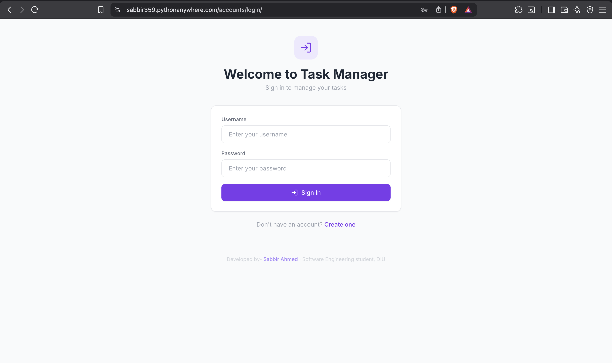
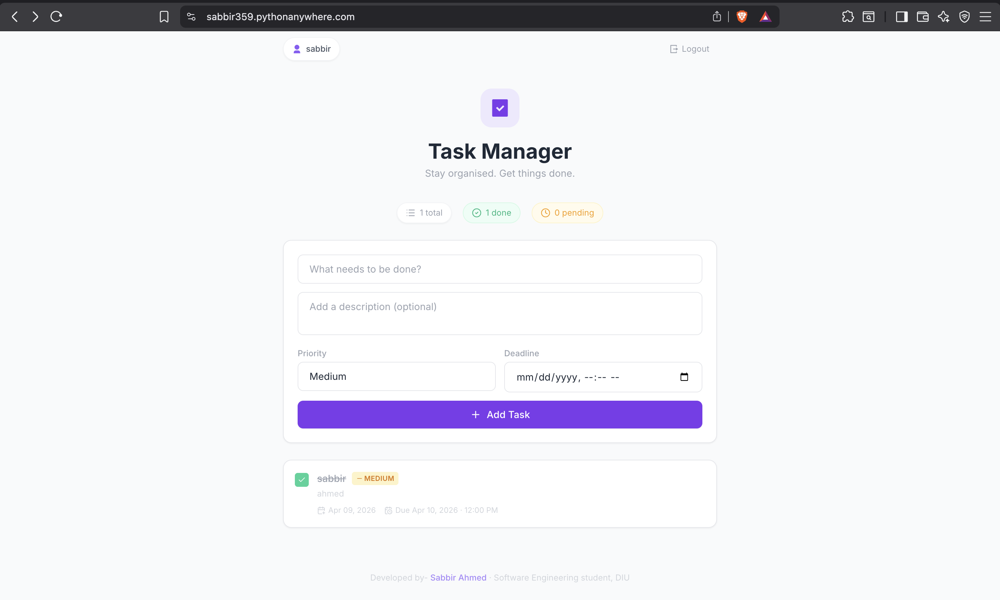

# ✅ Task Manager

A full-featured task management web application built with **Django** and **Tailwind CSS**. Manage your daily tasks with priorities, deadlines, and status tracking — all with a clean, modern UI.

🔗 **Live Demo:** [sabbir359.pythonanywhere.com](https://sabbir359.pythonanywhere.com)

---

## ✨ Features

- **User Authentication** — Register, login, and logout with secure per-user task isolation
- **CRUD Operations** — Create, read, update, and delete tasks
- **Priority Levels** — Assign Low, Medium, or High priority with color-coded badges
- **Deadline Tracking** — Set deadlines with visual overdue and "due soon" indicators
- **Task Toggle** — Mark tasks as complete/incomplete with one click
- **Responsive Design** — Works beautifully on desktop and mobile
- **Flash Messages** — Success/error notifications with auto-dismiss

---

## 🛠️ Tech Stack

| Technology | Purpose |
|---|---|
| **Django 4.2** | Backend framework |
| **SQLite** | Database |
| **Tailwind CSS** | Styling (CDN) |
| **Remix Icons** | UI icons |
| **Lucide Icons** | Additional icons |
| **Google Fonts (Inter)** | Typography |

---

## 📸 Screenshots

### Login Page



### Task Dashboard



---

## 🚀 Getting Started

### Prerequisites

- Python 3.9+
- [uv](https://docs.astral.sh/uv/) (recommended) or pip

### Installation

1. **Clone the repository**
   ```bash
   git clone https://github.com/gmsabbirahmed1/task-manager.git
   cd task-manager
   ```

2. **Create a virtual environment and install dependencies**
   ```bash
   # Using uv (recommended)
   uv venv
   uv pip install -r requirements.txt

   # Or using pip
   python -m venv .venv
   source .venv/bin/activate
   pip install -r requirements.txt
   ```

3. **Run migrations**
   ```bash
   python manage.py migrate
   ```

4. **Create a superuser (optional)**
   ```bash
   python manage.py createsuperuser
   ```

5. **Start the development server**
   ```bash
   python manage.py runserver
   ```

6. **Open** [http://127.0.0.1:8000](http://127.0.0.1:8000) in your browser

---

## 📁 Project Structure

```
task-manager/
├── taskmanager/          # Django project settings
│   ├── settings.py
│   ├── urls.py
│   └── wsgi.py
├── tasks/                # Main app
│   ├── models.py         # Task model with user FK
│   ├── views.py          # CRUD views with @login_required
│   ├── forms.py          # Task form with styled widgets
│   ├── auth_views.py     # Registration view
│   ├── auth_urls.py      # Auth URL routes
│   ├── urls.py           # Task URL routes
│   └── admin.py          # Admin configuration
├── templates/
│   ├── base.html         # Base layout with navbar & footer
│   ├── auth/
│   │   ├── login.html
│   │   └── register.html
│   └── tasks/
│       ├── task_list.html
│       └── task_update.html
├── static/css/
│   └── custom.css        # Custom animations & styles
├── manage.py
└── requirements.txt
```

---

## 🔐 Key Implementation Details

- **Per-user task isolation** — Each user only sees their own tasks via `Task.objects.filter(user=request.user)`
- **Secure access** — All task views are protected with `@login_required`
- **Ownership validation** — Update, toggle, and delete operations verify task ownership with `get_object_or_404(Task, pk=pk, user=request.user)`

---

## 👨‍💻 Developer

**Sabbir Ahmed**
Software Engineering Student, Daffodil International University

[](https://www.facebook.com/sabbir01765)
[](http://www.linkedin.com/in/sabbirAhmed12)
[](mailto:sabbir1359ahmed@gmail.com)

---

## 📄 License

This project is open source and available for educational purposes.
